# Suzuki Auto POS — Complete Project Documentation

## Table of Contents

1. [Project Overview](#1-project-overview)
2. [System Architecture](#2-system-architecture)
3. [Database Schema](#3-database-schema)
4. [User Roles & Access Control](#4-user-roles--access-control)
5. [Application Startup Flow](#5-application-startup-flow)
6. [Module Workflows](#6-module-workflows)
   - [Authentication](#61-authentication)
   - [Sales Order Lifecycle](#62-sales-order-lifecycle)
   - [Purchase Order Lifecycle](#63-purchase-order-lifecycle)
   - [Inventory & Restocking](#64-inventory--restocking)
   - [Customer Account & Payments](#65-customer-account--payments)
   - [Expense Tracking](#66-expense-tracking)
   - [Cash Book & Ledgers](#67-cash-book--ledgers)
   - [Analytics & Reports](#68-analytics--reports)
7. [Data Flow Between Modules](#7-data-flow-between-modules)
8. [Code Architecture](#8-code-architecture)

---

## 1. Project Overview

**Suzuki Auto POS** is a web-based Point of Sale and business management system tailored for auto spare parts dealerships. It is built with the **Flask** micro-framework following a clean **MVC architecture** with blueprints.

### Core Business Problem It Solves

```mermaid
graph LR
    A[🧑 Customer walks in] --> B[Staff creates Sale Order]
    B --> C[Admin approves & sets prices]
    C --> D[Stock deducted automatically]
    D --> E[Ledgers updated]
    E --> F[Receipt generated]

    G[📦 Stock running low] --> H[Admin creates Purchase Order]
    H --> I[Goods received from Distributor]
    I --> J[Stock updated automatically]
    J --> K[Supplier payable recorded]
```



### Tech Stack

| Layer | Technology |
|-------|------------|
| Backend Framework | Flask (Python) |
| Database ORM | SQLAlchemy |
| Authentication | Flask-Login |
| Frontend | Bootstrap 5, Chart.js, Select2 |
| Database | SQLite (dev) / PostgreSQL (prod) |
| Templating | Jinja2 |

---

## 2. System Architecture

```mermaid
graph TD
    Browser["🌐 Browser (Bootstrap + JS)"]

    subgraph Flask Application
        subgraph Routes["Routes Layer (Blueprints)"]
            R1[auth.py]
            R2[products.py]
            R3[sales.py]
            R4[purchases.py]
            R5[customers.py]
            R6[distributors.py]
            R7[expenses.py]
            R8[analytics.py]
            R9[main.py]
        end

        subgraph Controllers["Controllers Layer (Business Logic)"]
            C1[ProductController]
            C2[SalesController]
            C3[PurchasesController]
            C4[CustomerController]
            C5[DistributorsController]
            C6[ExpensesController]
            C7[AnalyticsController]
            C8[MainController]
        end

        subgraph Models["Models Layer (SQLAlchemy ORM)"]
            M1[User]
            M2[Product]
            M3[Order / OrderItem]
            M4[PurchaseOrder / PurchaseOrderItem]
            M5[Customer / CustomerTransaction]
            M6[Distributor / SupplierTransaction]
            M7[Expense / CashTransaction]
            M8[StockMovement / AuditLog]
        end
    end

    DB[(SQLite / PostgreSQL)]

    Browser --> Routes
    Routes --> Controllers
    Controllers --> Models
    Models --> DB
```



---

## 3. Database Schema


---

## 4. User Roles & Access Control

The system has two roles enforced by the `@role_required('admin')` decorator.


---

## 5. Application Startup Flow


---

## 6. Module Workflows

### 6.1 Authentication

```mermaid
sequenceDiagram
    actor User
    participant Browser
    participant AuthRoute as auth.py
    participant DB

    User->>Browser: Navigate to /login
    Browser->>AuthRoute: GET /login
    AuthRoute-->>Browser: Render login form

    User->>Browser: Submit username + password
    Browser->>AuthRoute: POST /login
    AuthRoute->>DB: Query User by username
    DB-->>AuthRoute: User record
    AuthRoute->>AuthRoute: check_password_hash(hash, password)
    
    alt Valid credentials
        AuthRoute->>AuthRoute: login_user(user)
        AuthRoute-->>Browser: Redirect to Dashboard
    else Invalid credentials
        AuthRoute-->>Browser: Flash "Invalid credentials" → Re-render login
    end
```



---

### 6.2 Sales Order Lifecycle

This is the core workflow of the system. Sales require **two steps**: a staff member creates a draft, and an admin approves it.


#### Detailed Approval Flow


---

### 6.3 Purchase Order Lifecycle

```mermaid
flowchart TD
    Admin([Admin]) --> CreatePO[POST /purchases/create\nSelect distributor + items]
    CreatePO --> SavePO[Save PurchaseOrder\nstatus=pending]
    SavePO --> Review[Review PO Detail page]

    Review --> Receive[POST /purchases/id/receive\nMark as received]
    Receive --> ForEachItem{For each item}
    ForEachItem --> LoadProduct[Load product with row lock]
    LoadProduct --> CalcWAC["Calculate Weighted Average Cost\nWAC = (old_qty×old_cost + new_qty×new_cost)\n/ total_qty"]
    CalcWAC --> UpdateProduct[Update product:\n- stock_quantity += qty\n- cost_price = WAC]
    UpdateProduct --> StockLog[Create StockMovement\nreference_type=purchase_receipt]
    StockLog --> ForEachItem
    ForEachItem --> |Done| CreatePayable[Create SupplierTransaction\ntype=payable]
    CreatePayable --> StatusReceived[PO status = received]

    Review --> RecordPayment[POST /purchases/id/payment\nRecord payment to supplier]
    RecordPayment --> SupplierTx[Create SupplierTransaction\ntype=payment]
    SupplierTx --> CashTx[Create CashTransaction\ntype=out]
    CashTx --> UpdateAmountPaid[Update PO amount_paid\nUpdate payment_status]
```



---

### 6.4 Inventory & Restocking

```mermaid
flowchart TD
    Admin([Admin]) --> ProductList[/products/ — View Catalog]
    ProductList --> ProductDetail[/products/id — Product Detail]

    ProductDetail --> EditBtn[Edit Product Details]
    ProductDetail --> RestockBtn[Quick Restock]
    ProductDetail --> DeleteBtn[Delete Product]

    RestockBtn --> RestockForm[/products/id/restock\nEnter qty, new cost, selling price, payment]
    RestockForm --> HasDist{Product has\ndistributor?}

    HasDist --> |Yes| CreatePO[Create PurchaseOrder\nstatus=received]
    CreatePO --> CreatePOItem[Create PurchaseOrderItem]
    CreatePOItem --> SupplierTx[Create SupplierTransaction\ntype=payable]
    SupplierTx --> PaidCheck{amount_paid > 0?}
    PaidCheck --> |Yes| PaymentTx[Create SupplierTransaction\ntype=payment + CashTransaction out]
    PaidCheck --> |No| CalcWAC2
    PaymentTx --> CalcWAC2

    HasDist --> |No| CalcWAC2["Calculate new WAC\ncost_price = (old_val + new_val) / total_qty"]
    CalcWAC2 --> UpdateStock[Update product.stock_quantity\nUpdate product.cost_price\nUpdate product.selling_price]
    UpdateStock --> StockMove[Create StockMovement\nreference_type=restock]
    StockMove --> Done([Redirect to Product Detail])
```

---

### 6.5 Customer Account & Payments

```mermaid
flowchart TD
    Admin([Admin]) --> CustomerList[/customers/ — View all customers]
    CustomerList --> CustomerDetail[/customers/id — Customer Detail]

    CustomerDetail --> OrdersTab[Orders Tab\nAll orders with amounts due]
    CustomerDetail --> LedgerTab[Account Ledger Tab\nAll debit/credit transactions]
    CustomerDetail --> PaymentForm[Record Account Payment]

    PaymentForm --> SubmitPayment[POST /customers/id/payment]
    SubmitPayment --> ValidateAmt{Amount > 0?}
    ValidateAmt --> |No| Error[Return error]
    ValidateAmt --> |Yes| CreateTx[Create CustomerTransaction\ntype=payment]
    CreateTx --> CreateCash[Create CashTransaction\ntype=in]
    CreateCash --> FIFO["FIFO Allocation:\nSort unpaid orders by created_at ASC\nAllocate payment to oldest orders first"]
    FIFO --> Done([Payment applied])
```

#### FIFO Payment Allocation Example

```
Customer owes:   Order #1 → Rs. 3,000   Order #2 → Rs. 5,000
Payment received: Rs. 4,000

Allocation:
  → Order #1: fully paid (Rs. 3,000)
  → Order #2: partially paid (Rs. 1,000 applied, Rs. 4,000 still due)
```

---

### 6.6 Expense Tracking


> **Note:** Expenses cannot be hard-deleted. If an expense was entered incorrectly, the admin edits the amount and an automatic cash book adjustment is recorded to keep the ledger accurate.

---

### 6.7 Cash Book & Ledgers

The system maintains **three interlinked ledgers**:

```mermaid
graph LR
    subgraph "Customer Ledger (Accounts Receivable)"
        CR1["receivable: Rs.+\n(when order approved)"]
        CR2["payment: Rs.−\n(when customer pays)"]
    end

    subgraph "Supplier Ledger (Accounts Payable)"
        SR1["payable: Rs.+\n(when PO received / restocked)"]
        SR2["payment: Rs.−\n(when we pay supplier)"]
    end

    subgraph "Cash Book"
        CB1["IN: sales, customer_payment"]
        CB2["OUT: supplier_payment, expense"]
    end

    SaleApproved([Sale Approved]) --> CR1
    SaleApproved --> CB1
    CustomerPays([Customer Pays]) --> CR2
    CustomerPays --> CB1

    POReceived([Purchase Order Received]) --> SR1
    WePaySupplier([We Pay Supplier]) --> SR2
    WePaySupplier --> CB2

    ExpenseAdded([Expense Added]) --> CB2
```



#### Running Balance Calculation

The Cash Book computes a running balance by iterating transactions in chronological order:

```
Balance = 0
For each transaction (oldest first):
    if type == 'in':  balance += amount
    if type == 'out': balance -= amount
    record running_balance = current balance

Return list in reverse (latest first) for display
```

---

### 6.8 Analytics & Reports

```mermaid
graph TD
    Admin([Admin]) --> AnalyticsDash[/analytics/ — Analytics Dashboard]

    AnalyticsDash --> Filter[Filter by Year + Month]
    Filter --> Metrics

    subgraph Metrics["Dashboard Metrics"]
        M1[Total Revenue\nsum of approved order amounts]
        M2[Gross Profit\nsum of order profits]
        M3[Total Expenses\nsum of expense amounts]
        M4[Net Profit = Gross Profit − Expenses]
        M5[Total Purchases\nsum of received PO amounts]
        M6[Total Receivables\namounts customers owe us]
        M7[Total Payables\namounts we owe suppliers]
    end

    subgraph Charts["Visual Charts"]
        CH1[Monthly Sales Line Chart\nCharts.js]
        CH2[Revenue Allocation Pie\nCOGS vs Expenses vs Profit]
    end

    subgraph Tables["Data Tables"]
        T1[Top 10 Selling Products\nby quantity + revenue + profit]
        T2[Top 5 Distributors\nby purchase volume]
    end

    AnalyticsDash --> Receivables[/analytics/receivables\nCustomers who owe money]
    AnalyticsDash --> Payables[/analytics/payables\nSuppliers we owe]
    AnalyticsDash --> CashBook[/analytics/cashbook\nFull cash ledger with filters]
    AnalyticsDash --> StockMov[/analytics/stock-movements\nAll inventory change logs]
```

---

## 7. Data Flow Between Modules

This diagram shows how a single business transaction creates records across multiple modules simultaneously:


---

## 8. Code Architecture

### Request Lifecycle


### Blueprint URL Structure

| Blueprint | Prefix | Example Routes |
|-----------|--------|----------------|
| `auth` | *(none)* | `/login`, `/logout` |
| `main` | *(none)* | `/` |
| `products` | `/products` | `/products/`, `/products/<id>`, `/products/admin` |
| `sales` | `/sales` | `/sales/create`, `/sales/orders/<id>` |
| `purchases` | `/purchases` | `/purchases/`, `/purchases/create`, `/purchases/<id>` |
| `customers` | `/customers` | `/customers/`, `/customers/<id>` |
| `distributors` | `/distributors` | `/distributors/`, `/distributors/<id>` |
| `expenses` | `/expenses` | `/expenses/`, `/expenses/add` |
| `analytics` | `/analytics` | `/analytics/`, `/analytics/cashbook`, `/analytics/receivables` |

### Controller Return Conventions

Controllers return **tuples** to routes for consistent error handling:

```python
# 2-tuple: (success: bool, message: str)
return True, "Product created successfully!"
return False, "Product not found."

# 3-tuple: (success, message, object)
return True, "Purchase order created!", purchase_order
return False, "Distributor required.", None

# 5-tuple for product details (uses *error unpacking)
return True, product, recent_sales, recent_purchases   # success
return False, None, None, None, "Product not found."   # failure
```

---

*Documentation generated for Suzuki Auto POS — February 2026*
